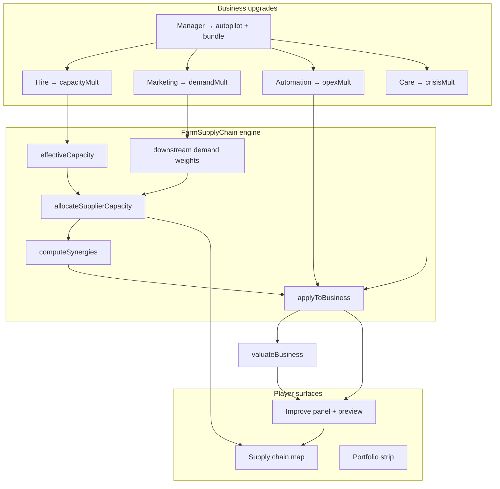

# EconGame 7.0 — Five-Axis Business Upgrades

Planning document for **MVP (6)+**: remap operational improvements to explicit business levers, tie valuation to profit impact, and surface cross-asset upside in **Improve** + **Supply Chain** views.

**Baseline:** `EconomyGame_MVP (6).html`, `js/farm-supply-chain.js`, `js/supply-chain-view.js`

**Design principle (north star):**  
Every improve decision should answer: *“Which lever moves my chain right now — and what’s the $ upside after capacity, demand, and neighbors?”*

**Scope:** Capital Farm mode only. Simulator keeps legacy `IMPROVEMENTS` (7 generic tracks) unless explicitly unified later.

**Accounting rule (carry forward from 6.0):**  
Internal links remain cost savings / reliability / utilization — not fake stacked revenue. Upgrades that raise **demand** or **capacity** change fulfillment and external revenue ceilings, not duplicate vertical integration top-line.

---

## 1. Player-facing model (five levers)

Replace the current seven one-shot improvements with **five tracks**, each **2–3 tiers** per business level.

| Track | ID | Primary effect | Chain role |
|-------|-----|----------------|------------|
| **Hire people** | `hire` | +effective **capacity** (throughput headroom) | Upstream / processing / infra: more units to serve owned + export. Consumer: “kitchen/seats/shelf” ceiling. |
| **Marketing** | `marketing` | +**demand** (foot traffic, orders, pull-through) | Raises downstream **requested** volume on incoming links and external revenue ceiling — **capped by supplier capacity + own capacity**. |
| **Automation** | `automation` | −**opex** (unit cost, labor) | Direct `operatingCosts` mult; may slightly reduce neglect severity on high-autopilot templates. |
| **Customer care** | `care` | −**urgency** weight; +relationship recovery | `crisisMult`, `clientHealth`, `supplierHealth`, `lastCareTurn`; stronger on low-autopilot assets. |
| **Manager** | `manager` | +**effective autopilot**; small passive drift on all four | Once per level capstone: +1 effective autopilot (cap +2 over template), extends neglect grace, tiny quarterly drift toward targets. |

### Tier curve (recommended numbers)

Per track, per business level:

| Tier | Effect per pick | Track cap (3 tiers) |
|------|-----------------|-------------------|
| Hire | +8% capacity mult | ~+24% |
| Marketing | +8% demand mult | ~+24% |
| Automation | −6% opex | ~−18% |
| Care | −20% crisis weight (multiplicative) | ~−49% vs baseline crisis rate |
| Manager | +1 effective autopilot; +3% each other track (one-time bundle) | **1× per level** |

Second tier on same track costs **×1.35**; third tier **×1.6** (accessibility curve, not weaker effects).

Manager is **not** “+20% on everything.” It is the integrator: less babysitting + modest stat bundle + drift.

---

## 2. Data model

### 2.1 On each portfolio business (`portfolio.businesses[]`)

```js
upgrades: {
  hire: 0,           // tier count 0–3
  marketing: 0,
  automation: 0,
  care: 0,
  manager: false,    // once per level
},
// Derived each turn or on demand — stored for UI speed optional:
upgradeStats: {
  capacityMult: 1.0,   // 1 + hire tiers × 0.08
  demandMult: 1.0,       // 1 + marketing tiers × 0.08
  opexMult: 1.0,         // automation product
  crisisMult: 1.0,       // care product (stacks with legacy crisisMult floor)
  effectiveAutopilot: 4, // template autopilot + manager bonus
}
```

**Migration:** Map legacy `improvementsApplied[]` ids → nearest new track + tier count for in-progress saves (one-time helper on load). New games start at zeros.

**Level-up / maturity:** On level advance, reset `upgrades` tiers to 0 and `manager` to false (same cadence as today’s `improvementsApplied` reset). Optional: carry **one** tier forward as “institutional memory” — defer unless playtest says levels feel punishing.

### 2.2 Template metadata extensions (`js/farm-supply-chain.js`)

Add optional fields to `TEMPLATES`:

| Field | Purpose |
|-------|---------|
| `capacityUnits` | Already exists for allocatable assets |
| `consumerCapacityUnits` | For restaurant / store — own throughput ceiling (seats, shelf turns) |
| `demandExportWeight` | How much marketing moves external vs chain demand (store high, feed mill low) |
| `marketingEligible` | false for pure infra RE if we don’t want marketing on Repair Shed |

Consumer channel businesses use **both**:
- **Inbound demand** = sum of fulfilled supplier links (existing `CONNECTION_DEMAND`)
- **Own capacity** = `consumerCapacityUnits` × `capacityMult`
- **Effective sales** = `min(inboundFulfillment × demandMult, ownCapacity × demandMult)` translated to revenue

---

## 3. Engine integration — how levers link across businesses

### 3.1 Capacity (Hire)

**Where it applies**

```
effectiveCapacity(state, templateId) =
  template.capacityUnits
  × agriConglomerateCapacityMult(state, templateId)   // existing edge
  × businessCapacityMult(state, templateId)           // NEW: from owned biz upgrades.hire
```

- If multiple businesses same template (edge case): use **max** or **sum** — pick **max** (one asset per template in MVP).
- Infrastructure RE: hire → `capacityUnits` on template node (more bays / cold room slots).
- Consumer: hire → `consumerCapacityUnits` mult (kitchen throughput, shelf capacity).

**Downstream effect:** Higher capacity → higher `fulfillRatio` on outgoing links → customers get more reliable inputs → their **effective demand** can convert to revenue/cost savings.

### 3.2 Demand (Marketing)

**Split demand into two buckets**

1. **Chain demand (internal)** — scales `CONNECTION_DEMAND` weights from this customer template:
   ```
   adjustedWeight(conn) = baseWeight × customerDemandMult
   ```
   Re-run `computeOwnedDownstreamDemand` / allocation with adjusted weights.

2. **External demand (consumer revenue)** — scales external revenue ceiling only:
   ```
   externalRevMult = demandMult × min(1, effectiveInboundFulfillment)
   ```
   Marketing on Grain Farm mostly grows **export slot yield**; marketing on General Store grows **walk-in revenue** — use `demandExportWeight` per template.

**Capacity cap (critical UX + math)**

```
fulfilledDemand = min(totalRequestedDemand, effectiveCapacity)
marketingUpside = f(demandMult) × min(1, capacity / requested)   // zero if bottlenecked elsewhere
```

Show **wasted marketing** when upstream supplier is short (amber link in supply chain view).

### 3.3 Automation (cost)

Apply in `applyToBusiness` / quarterly run rates:

```
operatingCosts × upgrades.opexMult × synergyCostReductions × strainOpexMult
```

Does **not** increase capacity. Valuation impact = Δ annualized profit × multiple.

### 3.4 Customer care (urgency)

Stack with existing neglect system:

- Each care tier: `crisisMult × 0.8`, +15 client/supplier health (× `improveCareRecoveryMult(template)`).
- `markBusinessCare(b, turn)` on care **and** manager purchase.
- Manager: +2 turns neglect grace; `neglectUrgentMult` dampened by effective autopilot.

### 3.5 Manager (meta)

On purchase:

- `effectiveAutopilot = min(5, templateAutopilot + 1 + priorManagerLevels)`
- One-time: `capacityMult`, `demandMult`, `opexMult` each × 1.03
- Each quarter while not neglected: passive drift +0.5% toward cap on hire/marketing/automation (floor 0, cap at tier max) — **optional Phase 2**; stub as “Manager stabilizes ops” copy first.

**Intervention reduction (UI):** Show autopilot stars using **effective** autopilot; urgent problem spawn rate ∝ `1 / effectiveAutopilot`.

---

## 4. Cross-business preview graph

Players must see **why marketing on Store is weak when Grain is at 110%**.

### 4.1 New engine helper: `computeUpgradePreview(state, businessId, trackId, nextTier)`

Returns:

```js
{
  cost,
  valBefore, valAfter, valDelta,
  profitBefore, profitAfter, profitDelta,  // quarterly, chain-aware
  local: { capacity, demand, opex, crisis, autopilot }, // before → after
  chain: [
    { connectionId, supplier, customer, fulfillBefore, fulfillAfter, binding: 'supplier'|'customer'|'self' },
    ...
  ],
  bottleneck: { templateId, name, utilPct, message },  // e.g. "Grain Farm 112% — hire there first"
  wastedPct: 0.35,  // marketing upside not realizable until bottleneck cleared
  warnings: ['Marketing +8% but Feed Mill inbound only 62% fulfilled'],
  recommendations: [{ templateId, track: 'hire', reason: 'Relieves shortage on 2 links' }]
}
```

**Implementation sketch**

1. Clone lightweight state snapshot.
2. Apply hypothetical tier to target business upgrades.
3. Recompute: `effectiveCapacity`, `allocateSupplierCapacity`, `computeSynergies`, `applyToBusiness` for full portfolio.
4. Diff consolidated profit + per-link fulfillment.

Cache previews per `(businessId, track, tier, turn)` in render cycle only — no persistence.

### 4.2 Bottleneck detection (reuse + extend)

Extend `detectSupplyShortages` / `computeSupplierUtilization`:

- **Supplier-bound:** upstream util > 100% or fulfill < 1 on link
- **Customer-bound:** consumer `demandMult` high but `consumerCapacity` saturated
- **Self-bound:** marketing on producer with no downstream owned — export-only upside

Rank bottlenecks for “portfolio story” and improve hints.

---

## 5. Valuation & pricing

### 5.1 Valuation (replace naive label matching)

Keep profit multiple core; add **explicit upgrade quality** term:

```js
function valuateBusiness(b, state) {
  const chainAware = modeCfg(state).farmTheme && state;
  const profit = chainAware
    ? FarmSupplyChain.quarterlyProfitForBusiness(b, state)  // NEW helper
    : b.revenuePerTurn - b.operatingCosts;
  const multiple = baseMultiple(b);  // existing ownerDep, custConc, equipment
  return round(max(1000, profit * 4 * clamp(multiple/2.5, 0.6, 1.6)) * cfg.valuationMult);
}
```

`quarterlyProfitForBusiness` uses same path as supply chain P&L row for that asset — upgrades affect value **through real profit**, not a parallel % label.

Preview panel shows: **“Est. value +$X (from +$Y/qtr profit)”**.

### 5.2 Upgrade cost

```js
benefitPoints = tierEffectToPoints(track, tier);  // e.g. hire T2 = 8 points
tierCostMult = [1, 1.35, 1.6][tierIndex];
baseCost = valuation * (benefitPoints / 5) * tierCostMult;
managerCost = valuation * 0.15;  // capstone, tune 0.12–0.18 in playtest
```

Remove legacy `imp.cost * 0.3` opaque multiplier.

**Payback hint in UI:** `ceil(cost / profitDelta)` quarters when `profitDelta > 0`.

---

## 6. UI / UX plan

### 6.1 Improve panel (right panel — `renderImproveBusinessPanel`)

Replace dropdown of seven improvements with:

1. **Business selector** (unchanged)
2. **Five-track grid** — each row:
   - Track name + icon
   - Tier pips (0/3) or ✓ Manager
   - **Next tier effect** one-liner
   - **Cost** · **Δ profit/qtr** · **Δ valuation**
   - Disabled state + reason (“Tier 3 max”, “Manager already applied”, “Need $X cash”)
3. **Chain impact strip** (below grid):
   - Top bottleneck badge
   - 1–3 link lines: `Grain → Feed: 78% → 91% if you Hire`
4. **Before / after bar** (mini): capacity | demand | opex | urgency | autopilot
5. **Apply** button per track (1 AP + cash) — keeps one improve action per click

Clicking a track expands **detail drawer** with full `computeUpgradePreview` chain table.

### 6.2 Supply chain view integration

When **View Supply Chain** is active:

| Interaction | Behavior |
|-------------|----------|
| Select owned node | Right panel adds **Upgrades** tab alongside P&L / allocation |
| Node tooltip | Show `capacityMult`, `demandMult`, util %, upgrade tier summary |
| Link color | Already encodes fulfillment — add **ghost preview** overlay when hovering an improve track (optional Phase 3) |
| Shortage banner | Action link: “Fix: Hire at {bottleneck}” → switches to Improve with pre-selected biz |

**Cross-highlight:** Selecting Marketing on General Store highlights inbound links (veg, dairy, bakery) in amber if any supplier < 90% fulfill.

### 6.3 Portfolio row (left panel)

Add compact **lever strip**:

`Cap ███░ Dem ██░░ Ops █░░░ Care ██░░ Mgr ✓`

Hover: numeric mults. Click opens Improve with that business selected.

### 6.4 Turn debrief & activity log

Extend improve log line (Phase A pattern):

```
Hire (T2) at Grain Farm · Cap 100→108 · Feed link 82%→94% · Profit +$1.2k/qtr · Val $240k→$258k
```

If wasted marketing:

```
Marketing (T1) at General Store · External demand +8% · ⚠ 31% unrealized — Grain Farm shortage
```

### 6.5 Field Guide (new carousel page)

**“Operational upgrades & the chain”**

- Five levers table
- Worked example: marketing before capacity vs after
- Manager as autopilot capstone
- Cost formula in plain language

---

## 7. Level-up & maturity cadence

Align with existing level system:

| Milestone | Trigger | Behavior |
|-----------|---------|----------|
| Major upgrade opp | Sum of tiers ≥ 8 **or** manager + 6 tiers | Surface `LEVEL_UP_TEMPLATES` opp (unchanged) |
| Auto mature | All tracks at tier 3 + manager | `AUTO_LEVEL_TEMPLATE` (unchanged) |
| Level advance | Level-up deal or auto mature | Reset upgrade tiers; preserve template autopilot base |

**Eligible tracks per layer (soft guidance, not hard locks)**

- Upstream / processing: Hire high ROI when util > 85%
- Consumer: Marketing + Hire paired
- Infra RE: Hire (= capacity) + Automation; no marketing
- Restaurant: Care + Manager early (low template autopilot)

Show **soft nudge** in preview, not hard disable.

---

## 8. File touch map

| Area | Files |
|------|--------|
| Upgrade constants & engine hooks | `js/business-upgrades.js`, `js/farm-supply-chain.js` |
| Improve UI, cost, doImprove, valuate | `EconomyGame_MVP (6).html` |
| Supply chain upgrade tab & tooltips | `js/supply-chain-view.js` |
| Regression tests | `scripts/regression-phase8.js`, `scripts/regression-upgrades.js` |
| Design checklist | this file |
| Field Guide copy | `EconomyGame_MVP (6).html` |
| Infographic demo (optional parity) | `Supply_Chain_Infographic.html` |

---

## 9. Implementation phases

### Phase 0 — Spec lock & migration scaffold
- [x] Finalize tier numbers in code constants (`UPGRADE_TRACKS`)
- [x] Add `upgrades` object to business factory + save migration from `improvementsApplied`
- [x] `recomputeUpgradeStats(business)` pure function
- [x] Feature flag: `modeCfg.farmUpgradeV2` default true in Capital Farm

### Phase 1 — Engine hooks (chain-aware math)
- [x] `businessCapacityMult(state, templateId)` → wired into `effectiveCapacity`
- [x] `businessDemandMult(state, templateId)` → wired into demand weights + external rev
- [x] `businessOpexMult(business)` → wired into `applyToBusiness`
- [x] Care + manager → neglect / crisis / `markBusinessCare` (neglect threshold + crisis mult; care apply in Phase 3)
- [x] `quarterlyProfitForBusiness(b, state)` for valuation

### Phase 2 — Preview & bottleneck helpers
- [x] `computeUpgradePreview(state, bizId, track, tier)`
- [x] `detectPortfolioBottlenecks(state)`
- [x] `recommendUpgrade(state)` for AP priority hint (optional)

### Phase 3 — Improve panel UI
- [x] Replace `IMPROVEMENTS` UI with five-track grid + preview strip
- [x] `doImproveTrack(bizId, trackId)` replaces effect switch in `doImprove`
- [x] `businessImproveCost(b, track, tier)` new formula
- [x] Before/after log + debrief lines

### Phase 4 — Supply chain & portfolio surfacing
- [x] Node detail: upgrade summary + “Improve this asset” shortcut
- [x] Link fulfillment preview in expand drawer
- [x] Portfolio lever strip
- [x] Shortage banner → deep link to hire at bottleneck

### Phase 5 — Balance, Field Guide, regression
- [x] Playtest 30-turn runs: time-to-payback, manager timing, shortage relief (payback band regression + phase8 30-turn sim)
- [x] Tune manager cost (0.12–0.18), tier costs, tier effect sizes (manager 15%, tier benefit/100 × val, tier mults 1/1.35/1.6)
- [x] Tests: capacity cap marketing; hire relieves shortage; valuation matches profit delta; migration
- [x] Field Guide page (Page 13 · Operational Upgrades)

### Phase 6 — Polish (optional)
- [x] SVG ghost preview on hover
- [x] Manager passive drift quarterly
- [x] Infographic demo sync

---

## 10. Test scenarios (acceptance)

1. **Marketing capped:** Own Grain + Store; Grain at 105% util → Store marketing T1 shows `wastedPct > 0`, profit delta small until Grain hire.
2. **Hire unlocks chain:** Feed Mill at 70% fulfill → Grain hire T1 raises fulfill and Feed profit in preview and after apply.
3. **Automation valuation:** Automation T3 −18% opex → valuate increases ≈ Δprofit×multiple (within rounding).
4. **Care on Restaurant:** crisisMult drops; urgent spawn rate lower over 5 turns; effective autopilot unchanged until Manager.
5. **Manager capstone:** once per level; second purchase blocked; neglect grace +1 effective autopilot star in UI.
6. **Consolidated P&L:** no double-count when marketing increases internal demand — external revenue rule unchanged.
7. **Migration:** save with 4× legacy improvements maps to sensible tiers; no NaN in valuation.

---

## 11. Balance notes (playtest knobs)

| Knob | Default | If too fast | If too slow |
|------|---------|-------------|-------------|
| Hire tier | +8% cap | +6% | +10% |
| Marketing tier | +8% demand | +6% | +10% |
| Automation tier | −6% opex | −5% | −7% |
| Cost divisor | benefit/5 | benefit/6 | benefit/4 |
| Manager cost | 15% val | 18% | 12% |
| Tier cost mult | 1, 1.35, 1.6 | steeper | flatter |

Target feel: **first tier pays back in 3–6 quarters** on a mid-margin business; **manager in 8–12**; full tier stack + manager feels like **one level-up** in power.

---

## 12. Out of scope (7.0)

- Literal inventory/SKU simulation
- Per-connection negotiable contracts
- Simulator mode parity
- Multiplayer / leaderboards
- Replacing RE improvements (Repair / Cold Storage keep property-themed upgrades; optional **Hire = bay expansion** flavor only)

---

## 13. Architecture diagram



---

## 14. Recommended implementation order

1. **Phase 0–1** — data + engine ( invisible; regression-safe behind flag )
2. **Phase 2** — preview helpers (enables accurate UI copy )
3. **Phase 3** — Improve panel (primary player touchpoint )
4. **Phase 4** — supply chain cross-links (teaches chain thinking )
5. **Phase 5** — balance + tests + Field Guide

**First playable milestone:** Phase 3 complete — player can hire Grain and see Feed fulfillment rise in log + preview, without full supply chain tab upgrades.

---

*Created: planning session — five-axis business upgrades aligned with MVP 6 supply chain hierarchy.*
